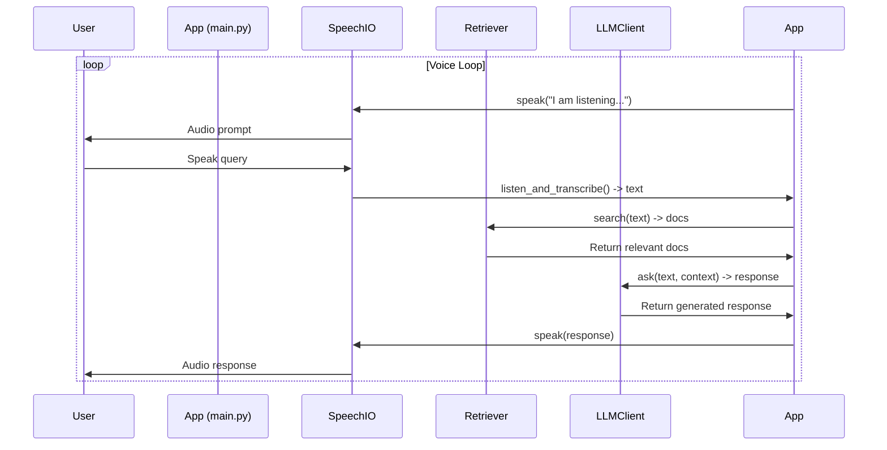

# Voice Assistant QA

A standalone, voice-driven question-answering assistant using only free, open-source libraries.

## Setup

1. **Clone the repository**  
   `git clone ...`

2. **Install dependencies**  
   `pip install -r requirements.txt`

3. **Install Ollama and pull a model**  
   - [Install Ollama](https://ollama.com/download)
   - Pull a model (e.g., llama3):  
     `ollama pull llama3`
      `ollama run llama3`

4. **Configure environment variables**  
   Copy `.env.template` to `.env` and set `OLLAMA_MODEL_NAME` (e.g., `llama3`).

5. **Add documents**  
   Place `.txt` or `.md` files in `voice_qa/data/docs/` to be indexed.

6. **Run the app**  
   `cd voice_qa`
   `python -m main`

## .env template

```env
# .env.template
OLLAMA_MODEL_NAME=llama3
OLLAMA_BASE_URL=http://localhost:11434
```

## Indexing new docs

Add your `.txt` or `.md` files to `voice_qa/data/docs/` and restart the app.

## Notes

- All components are free and open-source.
- Once the LLM is downloaded, the stack runs offline.
## Functionality and Flow

This is a voice-based question-answering (QA) assistant application built in Python. It integrates speech recognition, document retrieval, and large language model (LLM) generation to allow users to ask questions verbally about a set of pre-loaded documents (e.g., text or Markdown files). The app responds both textually (via console) and audibly (via speech synthesis). Below, I'll explain the overall functionality, key components, and the end-to-end flow based on the provided code files.

### Key Components and Functionality

1. **`main.py`** (Entry Point and Orchestrator):
   - Loads environment variables from a `.env` file (e.g., Ollama model name and base URL).
   - Initializes a `Retriever` instance to handle document search and a `LLMClient` instance for LLM interactions.
   - Runs an infinite loop for voice interaction:
     - Prompts the user to speak via audio output.
     - Captures and transcribes speech input.
     - Checks for an "exit" command to quit.
     - Uses the retriever to find relevant documents based on the transcribed query.
     - Passes the query and retrieved context to the LLM for a response.
     - Outputs the response via console and speech.
   - Handles keyboard interrupts for graceful exit.

2. **`retriever.py`** (Document Retrieval System):
   - Loads text (`.txt`) and Markdown (`.md`) files from a `data/docs` directory.
   - Embeds the document contents using Ollama's embedding model (`llama3` by default).
   - Stores embeddings in a FAISS vector database for efficient similarity search.
   - Provides a `search` method that performs similarity search on a query, returning the top-k (default 5) most relevant document chunks.

3. **`llm_client.py`** (LLM Interface):
   - Wraps the Ollama API for chat-based interactions.
   - Formats user queries with retrieved context into a structured prompt (e.g., "Context:\n[docs]\n\nQuestion: [query]\nAnswer:").
   - Sends the prompt to the specified Ollama model and returns the generated response.
   - Includes error handling for LLM failures, returning a fallback message if needed.

4. **`speech_io.py`** (Speech Input/Output):
   - **`listen_and_transcribe`**: Uses the `speech_recognition` library with Google Speech Recognition to capture audio from a microphone, adjust for ambient noise, and transcribe it to text. Handles errors like unrecognized speech or API issues.
   - **`speak`**: Uses `gTTS` (Google Text-to-Speech) to generate an MP3 audio file from text, converts it to a playable format with `pydub`, and plays it aloud. Includes error handling for synthesis failures.

### End-to-End Flow

The app operates in a continuous voice loop until the user says "exit". Here's the step-by-step flow:

1. **Initialization**:
   - Load environment variables (e.g., `OLLAMA_MODEL_NAME` and `OLLAMA_BASE_URL`).
   - Create a `Retriever` object: Load documents from `data/docs`, generate embeddings via Ollama, and build a FAISS vector store.
   - Create an `LLMClient` object with the specified model and URL.

2. **Voice Interaction Loop**:
   - Output audio: "I am listening Boss. Please speak."
   - Capture audio input via microphone and transcribe to text using Google Speech Recognition.
   - If transcription fails or is empty, skip and retry.
   - If the transcribed text is "exit" (case-insensitive), print "Goodbye!" and exit.
   - Perform document retrieval: Search the FAISS database for the top 5 similar documents based on the query.
   - Extract and concatenate the content of retrieved documents as context.
   - Generate a response: Send the query and context to the Ollama LLM, formatted as a prompt.
   - Output the LLM response: Print it to the console and synthesize/speak it aloud.
   - Repeat the loop.

3. **Error Handling and Exit**:
   - Speech recognition errors (e.g., network issues) are logged, and the loop continues.
   - LLM errors return a default apology message.
   - Keyboard interrupt (Ctrl+C) triggers a clean exit.

### Dependencies and Assumptions
- Relies on external services: Ollama for embeddings/LLM (must be running locally or at the specified URL), Google Speech Recognition API (requires internet), and Google TTS.
- Documents must be in `data/docs` as `.txt` or `.md` files.
- Assumes a microphone is available for input and speakers/headphones for output.
- No persistent storage beyond the FAISS index (rebuilt on each run).

### Flow Diagram
For clarity, here's a Mermaid sequence diagram illustrating the interaction flow:



This setup enables a conversational, hands-free QA experience over documents, with retrieval-augmented generation (RAG) to provide contextually relevant answers.